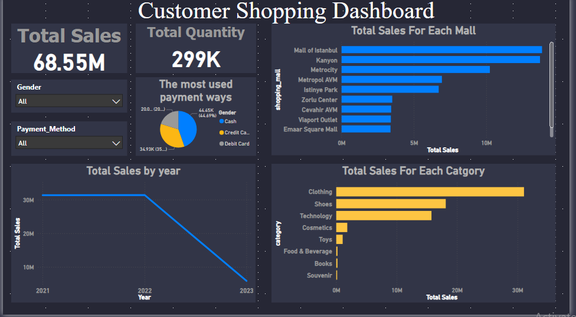

# 🛍️ Customer Shopping Dashboard

## 📌 Overview
Interactive Power BI dashboard analyzing customer shopping behavior, sales performance, and category insights.

## 📷 Dashboard Preview

### Main Dashboard

### GitHub Repository View

## 📊 Features
- Total Sales & Total Quantity
- Sales by Mall
- Sales by Category
- Most Used Payment Methods
- Yearly Sales Trend
- Dynamic Filters (Gender – Payment Method)

## 📁 Files Included
- `Customer Shopping DASH.pbix` — Power BI dashboard  
- `customer_shopping_data.csv` — Dataset  
- `PIC.png` — Dashboard screenshot  
- Additional screenshots

## 🛠️ Tools
- Power BI  
- DAX  
- CSV Data Source
